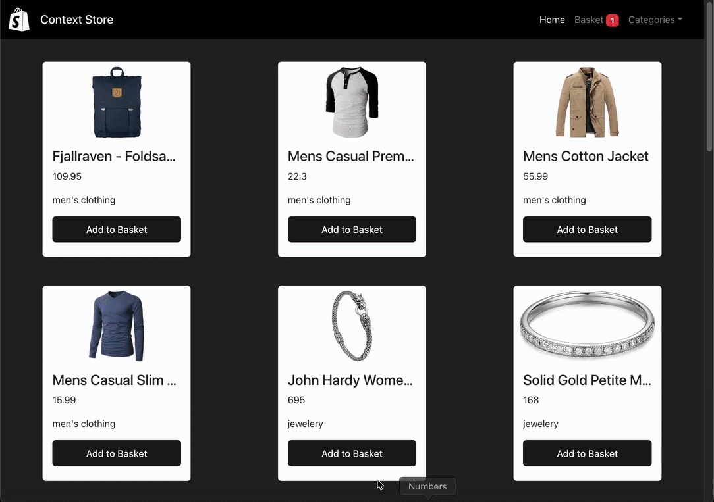

# HOC (Higher Order Components) [Yuksek Duzey Bilesenler]

- Prop olarak farkli bilesenleri alan ust duzey bilesenlerdir.
- Icerigi children propu alarak daha sonrasinda gonderebildigimiz bilesenler
<h1>Context Store </h1>

It is a sample shopping site design created with data taken from the fake API address using the Higher Order Components, Components and Context structure. Design is divided into categories within itself. It includes features such as adding and removing products to the basket, calculating the total product and price.

<h2>Screenshot </h2>

